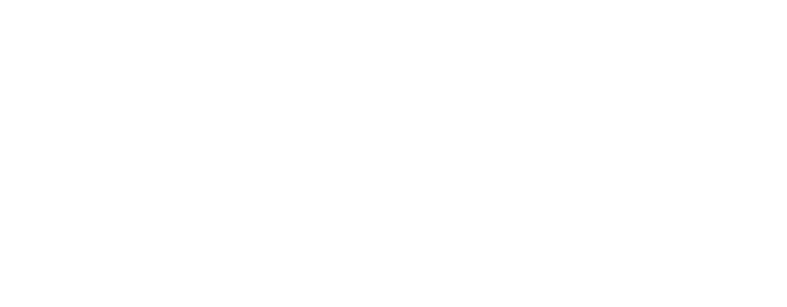

<div align="center">



<br>

### Indie Developer

I build software, experiments and weird things.

<br>

[](https://github.com/)
[](https://www.roblox.com/)

</div>

---

## About

I'm an indie developer interested in software, game development, artificial intelligence and experimental technologies.

I like building things from scratch, experimenting with unusual ideas and turning concepts into working systems.

---

## Tech Stack

### Languages


### Tools & Technologies


---

## Projects
[](https://github.com/stats-organization/github-stats-extended)

### NFF — Normalized Factor Flow

An experimental mathematical framework based on normalized factor flows.

> Research / experimentation

### Roblox Projects

Experimental Roblox systems, gameplay mechanics, procedural generation and custom modules.

### Experimental AI

Small experiments around artificial intelligence, signal processing and unconventional interfaces.

---

## GitHub Stats

<div align="center">


</div>

---

## Currently Building

```text
→ Experimental software
→ AI systems
→ Game development
→ Mathematical / computational experiments
→ Random ideas that probably shouldn't work
